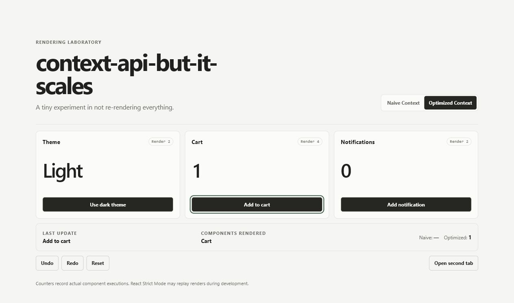

# context-api-but-it-scales

[](https://github.com/ogzkaann/context-api-but-it-scales/actions/workflows/ci.yml)
[](https://github.com/ogzkaann/context-api-but-it-scales/actions/workflows/deploy-pages.yml)

> React Context is slow—unless you stop using it like Context.

A focused rendering experiment that puts conventional shared Context beside a small selector-based external store. The interface measures its own component renders so the difference is visible, not benchmark theater.

**[Open the live demo](https://ogzkaann.github.io/context-api-but-it-scales/)**



## What this project demonstrates

- Why every consumer of one conventional Context value is scheduled when that value changes
- How `useSyncExternalStore` provides a concurrency-safe bridge to an external store
- Selector subscriptions that notify only when their selected value changes
- Immutable updates with stable actions and bounded undo/redo history
- Safe local persistence and loop-free synchronization through `BroadcastChannel`
- Render instrumentation that does not schedule extra card renders

| Action      |       Naive Context |    Optimized Store |
| ----------- | ------------------: | -----------------: |
| Update cart | All three consumers | Cart consumer only |

That table describes the expected mechanism. The numbers shown in the app are actual runtime observations from the three card components.

## Naive Context vs. optimized store

The naive provider places `theme`, `cartCount`, `notificationCount`, and the actions in one Context value. Each card reads that shared value. A cart update creates a new provider value, so all three consumers execute again even though two selected values are unchanged.

The optimized provider places a stable store object in Context. State lives outside React, and each card subscribes with a selector. On an update, the store compares the selector's previous and next results with `Object.is`; only a changed selection notifies React.

## How `useSyncExternalStore` is used

`useOptimizedSelector` gives React three things: a selector-aware subscribe function, a current snapshot getter, and the same getter for the client fallback. React can then read a consistent snapshot during concurrent rendering. The store publishes immutable state objects, while its action object remains stable for the lifetime of the store.

The render counters use refs as deliberate instrumentation. A layout effect publishes the committed count to a separate measurement registry, and the comparison result subscribes to that registry. Updating the summary therefore does not contaminate the three counters. In development, React Strict Mode may replay component executions; the app and counters say so explicitly.

## History, persistence, and cross-tab sync

The optimized store keeps a bounded in-memory past/future history. Undo and redo produce normal state publications, so subscribers, persistence, and other tabs see the restored state.

Current state is stored in a versioned `localStorage` envelope. Invalid data and storage exceptions fall back safely. Each tab also gets an instance ID and sends state messages over `BroadcastChannel`; incoming messages are applied without being rebroadcast, preventing synchronization loops. Both browser APIs are optional, so the demo remains usable when either is unavailable.

## Project structure

```text
src/
├── components/       # Single-page interface and measured cards
├── hooks/            # Render instrumentation hook
├── measurement/      # Observed render registry and tracking context
├── state/
│   ├── core/         # Shared types, validation, persistence, and sync
│   ├── naive/        # Conventional shared Context implementation
│   └── optimized/    # Selector store and React adapter
└── tests/            # Store, Context, and interaction tests
```

## Running locally

Node.js 20 or newer is required.

```bash
npm ci
npm run dev
```

Useful checks:

```bash
npm run lint
npm run typecheck
npm test
npm run test:coverage
npm run build
```

## Testing

Vitest and React Testing Library verify the behavior rather than snapshots: selector notification isolation, naive Context fan-out, undo/redo, persistence recovery, invalid data, storage failures, cross-tab loop prevention, runtime render observations, and keyboard-operated controls.

GitHub Actions runs install, lint, type-check, test, and production build on pushes and pull requests. A separate least-privilege workflow deploys `dist` to GitHub Pages.

## Technical decisions

- No state-management dependency: the point is to expose the subscription mechanism.
- One immutable state shape and one action contract keep the two modes interchangeable.
- A 50-entry history bound keeps the example understandable and memory use predictable.
- Plain CSS keeps the visual layer small and makes the responsive/theme behavior explicit.
- Vite's base path is fixed to the repository name for deterministic Pages assets.

## Limitations

- This is an educational implementation, not a replacement for a state-management library.
- Selector results should be referentially stable; object-producing selectors need their own memoization strategy.
- History is in memory and is not restored after a reload; only current state is persisted.
- `BroadcastChannel` synchronizes tabs on the same origin and has no server-side equivalent.
- The comparison measures component executions, not elapsed time or application-wide performance.

## Legacy version

The original React 17 theme demo and its full history remain available on [`legacy/react17-theme-context`](https://github.com/ogzkaann/context-api-but-it-scales/tree/legacy/react17-theme-context) and at the annotated [`legacy-v1`](https://github.com/ogzkaann/context-api-but-it-scales/releases/tag/legacy-v1) tag.

## License

[MIT](./LICENSE)
